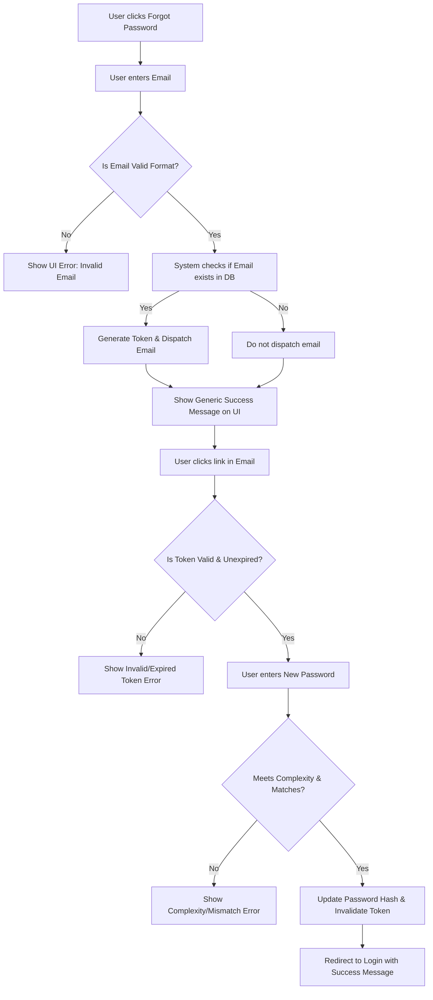

# User Password Reset via Email Link

**ID:** ASDF-PR-001
**Version:** 1.0
**Status:** Draft
**Type:** Functional Specification

## Overview & Purpose
The purpose of this feature is to allow registered users who have forgotten their password to securely regain access to their accounts. This is achieved by allowing users to request a time-bound, single-use reset link sent to their registered email address, through which they can authenticate and set a new password.

## Goals
- Provide a secure, self-service account recovery mechanism for end users.
- Reduce password-related customer support tickets by 80%.
- Ensure account security is maintained during the recovery process by preventing email enumeration and enforcing token expiration.

## Target Users
- **Registered Users:** Individuals with an existing account on the platform who have lost or forgotten their password credentials.

## Stakeholders
- **Product Manager:** Feature prioritization, scope definition, and success metric tracking.
- **Security Team:** Approval of token generation, encryption standards, and anti-enumeration measures.
- **Customer Support:** Monitoring the reduction in support tickets and handling edge-case recovery escalations.

## Scope (In / Out)
**In Scope:**
- "Forgot Password" request form (email input).
- Generation of secure, time-bound, single-use reset tokens.
- Email delivery of the reset link.
- "Set New Password" form with password complexity validation.
- Updating the user's password hash in the database.

**Out of Scope:**
- SMS, authenticator app, or biometric password resets.
- Admin-initiated password resets from a back-office dashboard.
- Account recovery workflows for users who have permanently lost access to their registered email inbox.

## MoSCoW
**Must Have:**
- Email input form for reset request.
- Secure token generation (single-use, 15-minute expiry).
- Email delivery integration.
- Password update form with complexity validation.
- Generic success messages to prevent email enumeration.

**Should Have:**
- Rate limiting on reset requests (max 3 per hour per email) to prevent spam and abuse.

**Could Have:**
- "Magic link" direct login option without requiring the user to set a new password immediately.

**Won't Have:**
- SMS-based recovery (deferred to a future release).

## Functional Requirements
- **FR1: Password Reset Request Form**
  The system shall provide a page where users can submit their email address to request a password reset.
  - *Acceptance Criteria:* Given a user is on the login page, When they click "Forgot Password", Then they are routed to a form requesting their email address.
- **FR2: Secure Token Generation**
  The system shall generate a unique, cryptographically secure token valid for 15 minutes upon a valid email submission.
  - *Acceptance Criteria:* Given a user submits a registered email, When the system processes the request, Then a 15-minute single-use token is generated and associated with the user's account in the database.
- **FR3: Anti-Enumeration & Email Dispatch**
  The system shall send an email containing the reset link only if the email exists in the system, but must display the same success message regardless of existence.
  - *Acceptance Criteria:* Given a user submits an email, When the form is submitted, Then a generic success message is displayed on the UI AND an email is dispatched only if the email is registered.
- **FR4: Token Validation**
  The system shall validate the token when the user clicks the email link.
  - *Acceptance Criteria:* Given a user clicks a reset link, When the system evaluates the token, Then it must verify the token exists, belongs to a valid user, has not been previously used, and is not expired.
- **FR5: Password Update**
  The system shall allow the user to set a new password meeting complexity requirements (minimum 8 characters, 1 uppercase, 1 number).
  - *Acceptance Criteria:* Given a user is on the reset password page with a valid token, When they submit a new password meeting complexity rules, Then their password hash is updated in the database and the token is marked as used.

## User Stories
- **US1:** As a registered user, I want to request a password reset link so that I can regain access to my account if I forget my password.
  - *Acceptance Criteria:* Given I have forgotten my password, When I enter my email on the forgot password page, Then I receive an email with a reset link.
- **US2:** As a registered user, I want to click a secure link in my email so that I can securely authenticate my reset request without needing my old password.
  - *Acceptance Criteria:* Given I have received a reset email, When I click the link within 15 minutes, Then I am taken to a secure page to enter a new password.
- **US3:** As a registered user, I want to set a new password so that I can log in.
  - *Acceptance Criteria:* Given I am on the new password page, When I enter and confirm a valid new password, Then my password is saved and I am redirected to the login page with a success message.

## Inputs, Outputs & Data Flow
**Inputs:**
- User email address (string, validated for email format).
- New password (string, secure input).
- Password confirmation (string, secure input).

**Outputs:**
- Password reset email (HTML/Text containing the tokenized URL).
- UI success/error messages.

**Data entities / models touched:**
- `User`: Reads `email` for lookup, updates `password_hash` upon successful reset.
- `PasswordResetToken`: Creates new record (`token_string`, `user_id`, `expires_at`, `is_used`), updates `is_used` to `true` upon successful password change.

## Flows & Diagrams

## Edge Cases & Error States
- **Unregistered Email:** If an email is not in the database, the system displays the standard success message ("If an account exists, an email has been sent") to prevent user enumeration. No email is sent.
- **Expired Token:** If the link is clicked after 15 minutes, the system displays "This link has expired. Please request a new one." with a CTA button routing back to the request form.
- **Reused Token:** If the link is clicked after the password has already been reset, the system displays "This link has already been used."
- **Rate Limiting:** If a user requests more than 3 resets in 1 hour for the same email, the system displays "Too many requests. Please try again later." and does not process further token generation or emails.
- **Password Mismatch:** If "New Password" and "Confirm Password" do not match, an inline validation error is displayed preventing form submission.

## Acceptance Criteria
- **Given** a user submits a valid, registered email, **When** they check their inbox, **Then** they receive a reset email within 2 minutes.
- **Given** a user clicks an expired or previously used link, **When** the page loads, **Then** an error message is displayed preventing the password reset form from rendering.
- **Given** a user successfully resets their password, **When** they attempt to log in with the new password, **Then** they are successfully authenticated.
- **Given** a user successfully resets their password, **When** they attempt to use the same reset link a second time, **Then** access is denied and an error is shown.
- **Given** a malicious actor attempts to submit 10 reset requests in a minute, **When** the 4th request is submitted, **Then** the system blocks the request via rate limiting.

## Non-Functional Requirements
- **Security:** Tokens must be cryptographically secure (e.g., UUIDv4 or minimum 32-byte secure random string). Passwords must be hashed using bcrypt or Argon2 before storage.
- **Performance:** The reset email must be dispatched to the SMTP server/email provider within 2 seconds of form submission to ensure rapid delivery.
- **Accessibility:** All forms (Forgot Password, Set New Password) must meet WCAG 2.1 AA compliance, including proper ARIA labels, color contrast, and full keyboard navigability.

## Assumptions, Dependencies & Open Questions
**Assumptions:**
- The system has a functioning, highly available email delivery service (e.g., SendGrid, AWS SES) configured.
- Users have continuous access to the email address associated with their account.

**Dependencies:**
- External Email Service Provider API for dispatching transactional emails.
- Frontend routing system capable of parsing URL parameters (e.g., `/reset-password?token=XYZ`).

**Open Questions:**
- Do we want to implement a CAPTCHA (e.g., reCAPTCHA v3) on the "Forgot Password" form in this initial release to further prevent bot abuse, or rely solely on rate limiting?
- Should active user sessions across all devices be automatically terminated when a password is successfully reset?

## Success Metrics
- **KPI 1:** 90% or higher completion rate for initiated password resets (measured from email sent to password successfully changed).
- **KPI 2:** 80% reduction in customer support tickets categorized under "password reset" or "cannot log in" within 30 days of feature launch.